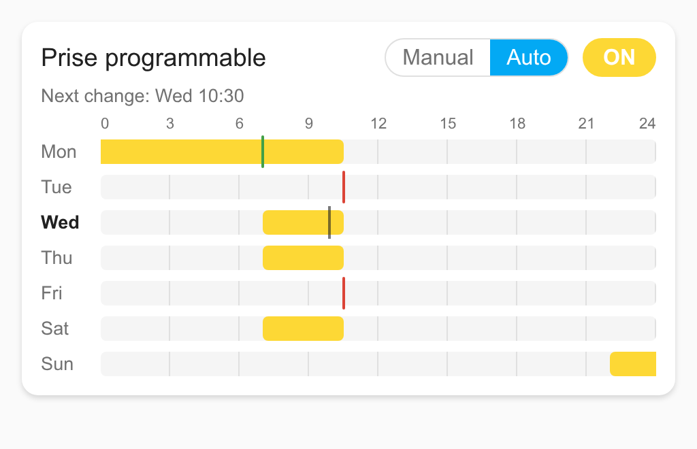
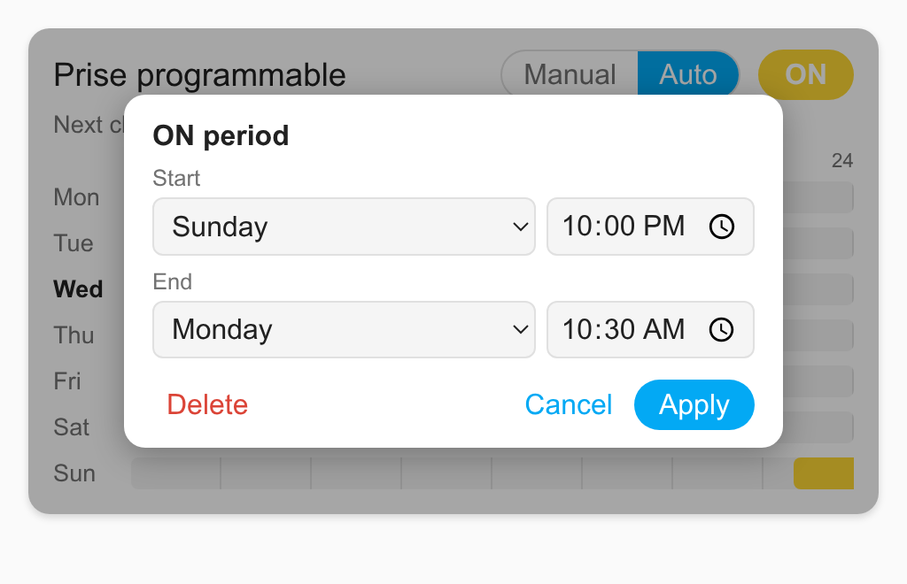

# Weekly Schedule Card

A Home Assistant Lovelace card to **view and edit a weekly ON/OFF schedule** that a device runs by itself, stored
as **one text entity per day**:

```
schedule_monday = "07:00/ON 10:30/OFF"
```

Each time gives the state **from that time on**; before the first change of a day, the state of the previous day
carries on (a night period is `22:00/ON` on Monday and `02:00/OFF` on Tuesday). The card draws the resulting ON
periods over the week, lets you add, move and delete them, keeps single changes (for example a daily
`10:30/OFF` safety stop) and writes back only the days you changed.

Written for the **TYZS6 programmable plug** (Tuya TS011F with a custom Zigbee firmware and a Zigbee2MQTT converter
exposing `schedule_<day>`, `mode` and `override`), and usable with any device that exposes the same per-day texts.



## Features

- Week grid (Monday to Sunday, 0–24 h) with the ON periods, periods across midnight and across the end of the week.
- **Click an empty spot** to add a one-hour period, **click a period** to change its start / end (day and time) or
  delete it.
- **Single changes** (a stop or a start that does not switch the state, like an "OFF every day at 10:30" safety
  stop) are shown as thin red / green marks, and can be added, changed and deleted.
- **Click a day** to edit its changes as text, copy the day to other days, or clear it.
- Changes are kept until you press **Save**; then only the changed days are written, and the card checks that the
  device confirmed them.
- Header: ON/OFF button, **Manual / Auto** mode, override badge, next change.
- No external dependency, English and French (follows the language of Home Assistant), light and dark themes.



## Installation

### HACS

1. HACS → ⋮ → **Custom repositories** → `https://github.com/BasicCPPDev/ha-weekly-schedule-card`, category
   **Dashboard**.
2. Download **Weekly Schedule Card**, then reload the browser.

### Manual

Copy `ha-weekly-schedule-card.js` to `/config/www/`, then add the resource `/local/ha-weekly-schedule-card.js`
(type **JavaScript module**) in Settings → Dashboards → ⋮ → Resources.

## Configuration

```yaml
type: custom:weekly-schedule-card
entity: switch.prise_programmable
```

| Option | Default | Description |
|---|---|---|
| `entity` | (required) | Switch of the device. |
| `title` | friendly name | Card title. |
| `step` | `15` | Minutes used when clicking the grid and in the time fields. |
| `schedule_entities` | found | `{monday: text.…, …, sunday: text.…}` |
| `mode_entity` | found | `select` with the options `manual` / `auto`. |
| `override_entity` | found | `binary_sensor`, on while a manual change overrides the schedule. |
| `next_change_entity` | found | `sensor` with the next change (`YYYY-MM-DD HH:MM`). |

The other entities are **found automatically** on the same device as `entity` (entity ids ending with
`_schedule_monday` … `_schedule_sunday`, `_mode`, `_override`, `_next_change`), or from the entity name
(`switch.x` → `text.x_schedule_monday`, `select.x_mode`, …). The options above override them.

## Schedule format

- One text per day: changes `HH:MM/ON` or `HH:MM/OFF`, separated by spaces, at most 20 per day.
- A change gives the state from that time on; the last change of the week carries on to Monday.
- An empty week in auto mode means OFF (on the TYZS6 plug).

## Versions

Versions follow the Home Assistant style: `YYYY.M.D-NN` (date of the release, `NN` = release of the day).
A push to `main` by the owner with `[release]` in the commit message creates the tag and the GitHub release.

## Development

- Tests of the schedule model: `node --test test/`
- Visual test page with a fake `hass` object: serve the repository (`python3 -m http.server`) and open
  `test/demo.html` (`?lang=en|fr`, `&dark=1`, `&click=block|track|day|marker|edit|save`).

## License

MIT, see [LICENSE](LICENSE).
